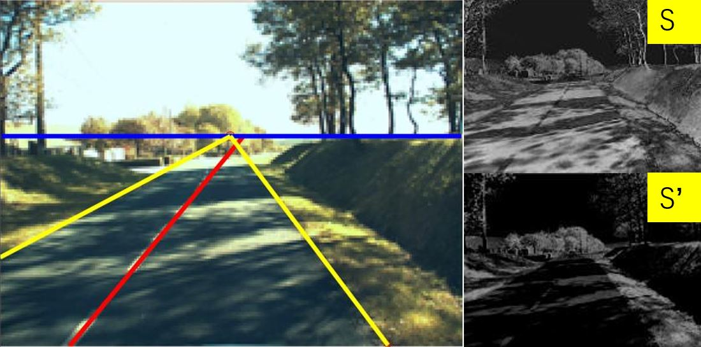

<b><a href="#overview">Overview</a></b>
|
<!-- <b><a href="#features">Features</a></b>
| -->
<b><a href="#installation">Installation</a></b>
|
<!-- <b><a href="#updating">Updating</a></b>
| -->
<b><a href="#setup">Setup</a></b>
|
<!-- <b><a href="#structure">Structure</a></b>
| -->
<b><a href="#acknowledgment">Acknowledgment</a></b>
|
<b><a href="#license">License</a></b>

 

<!-- CCF Ranking -->
<!-- https://img.shields.io/badge/color-brightgreen-brightgreen.svg?maxAge=2592000 -->

[][license]

<!---->
<!-- [][vote] -->
<!-- [][doc] -->

## Overview

Code for the [ISM 2015](http://www.ieeeism.com/) paper "Illumination-Robust Approach for Feature-Based Road Detection" 
( ieeexplore 
[paper](http://ieeexplore.ieee.org/xpls/abs_all.jsp?arnumber=7442341)
[html](http://ieeexplore.ieee.org/xpls/icp.jsp?arnumber=7442341)
[pdf](http://ieeexplore.ieee.org/stamp/stamp.jsp?tp=&arnumber=7442341)
)

## Citation

    @INPROCEEDINGS{ying2015ism, 
    author={Z. Ying and G. Li and G. Tan}, 
    booktitle={2015 IEEE International Symposium on Multimedia (ISM)}, 
    title={An Illumination-Robust Approach for Feature-Based Road Detection}, 
    year={2015}, 
    pages={278-281}, 
    keywords={feature extraction;image colour analysis;intelligent transportation systems;cast shadows;feature-based method;grayscale image;illumination-related effects;input color image;intelligent vehicle systems;lane-marking detection;road boundary lines;road detection algorithms;Feature extraction;Gray-scale;Image color analysis;Image edge detection;Lighting;Roads;Transforms;image processing;intelligent vehicle systems;lane detection;road detection}, 
    doi={10.1109/ISM.2015.46}, 
    month={Dec},}

<!-- ## Contributions -->

## Installation

1. Download roma dataset from [official website](http://www.lcpc.fr/english/products/image-databases/article/roma-road-markings-1817) or [baiduyun](http://yun.baidu.com/share/link?shareid=1552701070&uk=1863129434) `OpenVehicleVision/datasets/ROMA/roma.zip`.
2. Download [latest released code](https://github.com/baidut/s-prime/releases) .

## Setup

    ./add_to_path       % required libraries
    ./roma              % roma dataset
    ./roadDetection.m   % main algorithm
    ./demo.m
    
1. Open Matlab and `cd your_path` e.g. `cd E:\Documents\MATLAB\s-prime`
2. Add `add_to_path` to matlab path.
2. Run `demo`. (or `demo method roma_dataset_path` e.g. `demo ours E:\Documents\MATLAB\s-prime\roma` ), then the detection results will be displayed and be stored to subfolder `.\result-*`, after processing all the result, an evaluation report will be generated automatically in latex, see `.\result-*\evaluation.tex` 

## Acknowledgment 

This project was supported by Shenzhen Peacock Plan (20130408-183003656), and by Science and Technology Planning Project of Guangdong Province, China (No. 2014B090910001).

## License

Copyright (c) 2015-2016 Zhenqiang Ying

Licensed under the [MIT license][license].

<a href="#top">:arrow_up: back to top</a>

[license]: ./LICENSE

